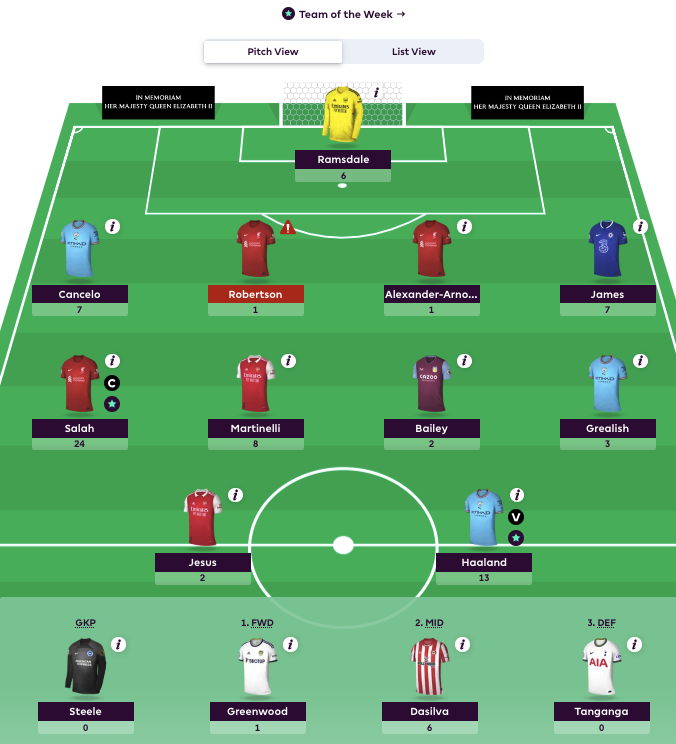
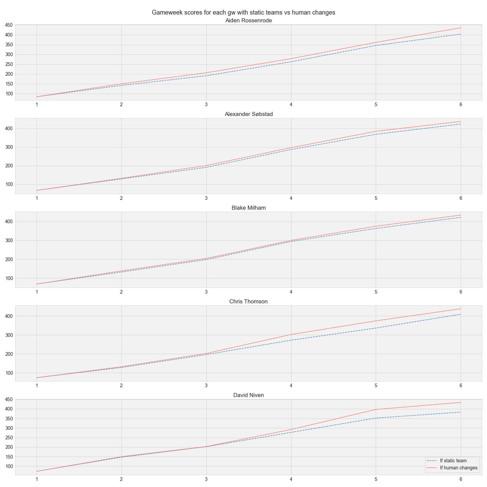
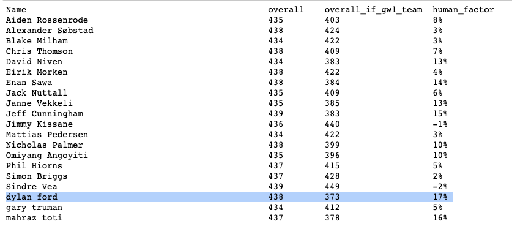

Track record for blogging experiments up to date - disastrous. 

I've been playing Fantasy Football for a few years now. You get to pick the players you think will perform best in the coming gameweek with a set of constraints such as limited transfer decisions per week, limited amount of money to spend to buy players, limited game formations etc. There are a lot of uncertain factors in this game, but the human action involved each week is to choose some players to transfer out and be replaced by other players. More than 1 transfer decision costs 4 points. 

My objective was to see how optimal my transfer decisions had been from gameweek-to-gameweek. I wanted to see what my team would look like if I had the exact same team throughout as I did in the beginning of the season (GW 1) versus how it performed with my transfer decisions. Here is my Gameweek 1 team for this season:

 


The code walkthrough for this experiment is below. I use a randomly chosen league for the blog. The website has an API which makes it easy to analyze and collect the data. This script requires having the "FPL_EMAIL" and "FPL_PASSWORD" environment variables populated. 

```
import requests
import json
import numpy as np
import pandas as pd
import datetime
from pprint import pprint

import asyncio
import aiohttp
from fpl import FPL

async def my_team(user_id):
    async with aiohttp.ClientSession() as session:
        fpl = FPL(session)
        await fpl.login()
        # login is required for private(?) leagues
        user = await fpl.get_user(user_id)
        team = await user.get_team()
        h2h_league = await fpl.get_classic_league(2)
        league_players = dict(( player['player_name'], player['entry']) for player in h2h_league.standings['results'][10:30])
        return league_players

league_players = await my_team(5827336)
# final gameweek to be considered.
gameweek_last = 7
```

Next, a function to determine the total points gained by a particular player in their gameweek history:

```
def get_player_total_points(element, is_captain, multiplier):
    '''
    Retrieve total points of a football player until `gameweek_last` GW.
    
    The starting 11 players from the 1st Gameweek's team are used to 
    calculate total points for the static team until `gameweek_last`.
    If players on the bench would have substituted one of the 11 players,
    this scenario is excluded from the calculation thereby only providing
    an approximation.
    
    The player that was captained in the 1st GW gets double the points.
    The scenario where the captain is substituted by the vice captain
    is also excluded from the calculation.
    '''
    link = "https://fantasy.premierleague.com/api/element-summary/{}/".format(element)
    response = requests.get(link)
    data = json.loads(response.text)

    # get total points of player
    tp = 0
    tp_by_gw = []
    for k in data['history']:
        if k['round']>gameweek_last:
            continue
        if 'total_points' in k:
            if is_captain:
                tp+= k['total_points']*2
            else:
                tp+= k['total_points']*multiplier
            tp_by_gw.append(tp)    
    
    return tp, tp_by_gw
```

Finally, we get all the information together for the manager's total points with managed teams and total points with static teams.

```
players = {}
for player, player_id in league_players.items():
    link = 'https://fantasy.premierleague.com/api/entry/{}/'.format(player_id)
    response = requests.get(link)
    data = json.loads(response.text)
    summary_overall_points = data['summary_overall_points']
    
    # get total points of manager's team in gameweek history
    gw_points = []
    for gw in range(1,gameweek_last):
        link = 'https://fantasy.premierleague.com/api/entry/{}/event/{}/picks/'.format(player_id,gw)
        response = requests.get(link)
        data = json.loads(response.text)
        gw_points.append(data['entry_history']['total_points'])
    
    link = 'https://fantasy.premierleague.com/api/entry/{}/event/1/picks/'.format(player_id)
    response = requests.get(link)
    data = json.loads(response.text)
    total_points = 0
    players_points = {}
    gw_points_if_first_team = []
    
    # cycle through each player picked by manager
    # get total points in gameweek history
    for entry in data['picks']:
        element = entry['element']
        if entry['multiplier']:
            element_tp, tp_points_by_gw = get_player_total_points(element, entry['is_captain'], entry['multiplier'])
            players_points[player_names[int(element)]] = element_tp
            gw_points_if_first_team.append(np.array(tp_points_by_gw))
    
    gw_points_if_first_team = np.sum(np.array(gw_points_if_first_team),axis=0)
    
    total_points = sum([v for k,v in players_points.items()])
    players[player] = {'team':players_points,'total_points':total_points,
                       'summary_overall_points':summary_overall_points,
                       'gw_points':gw_points,
                       'gw_points_if_first_team':gw_points_if_first_team
                      }
    print(player,players[player])
```

I use this data to plot the cumulative sum of the gameweek total points based on both scenarios to get this graph:

 

And a summary with the percentage gains of actively making transfer decision over having the static team:

 

This shows the percentage gain achieved by making active transfer decisions over - if the team was left as is after the first gameweek. My personal stats for 2021 was a 7% gain when actively managing the team. Interestingly, some of my teammates who were at the top of the league also saw a negative gain, showing active interference overall fared worse for them. I'm going to use this graph to rethink how much time I spend thinking about transfer decisions and if that is worth it! Cheers.