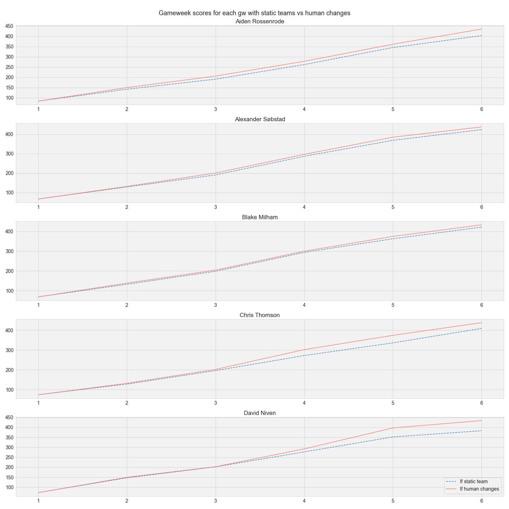
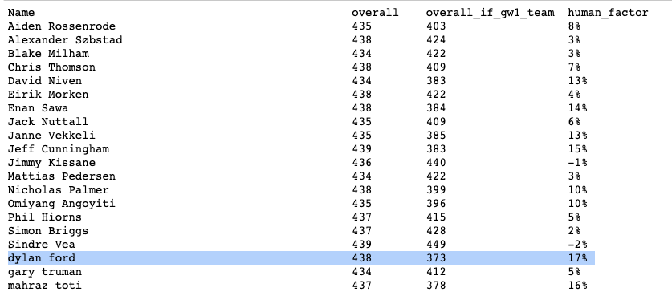

+++
date = '2022-09-16T23:27:30-04:00'
draft = true
title = 'Optimal Decision Making in Fantasy Football'
+++

Fantasy Football is a game of constrained optimisation. Each gameweek, managers must choose players under fixed rules: a set budget, limited transfers, formation restrictions, and a 4-point penalty for every extra transfer beyond the weekly allowance. The uncertainty comes from player performance — injuries, form swings, and fixture difficulty — but the core decision each week is a transfer choice.

To measure the real impact of those choices, I ran a season-long counterfactual analysis. I compared two scenarios:

1. Actual season – my team’s performance with all the transfers I made.
2. No-transfer baseline – the exact same Gameweek 1 squad kept unchanged all season.

The difference between these scenarios gives a clearer picture of how much value my transfer strategy actually added.

Here’s the Gameweek 1 team that served as the baseline for this analysis:

 


Below is the code walkthrough for this experiment, using data from a randomly selected public league as an example. The Fantasy Premier League website provides an accessible API, which makes collecting and analysing the necessary data straightforward. To run the script, you’ll need to set the environment variables FPL_EMAIL and FPL_PASSWORD with your account credentials.

```
import requests
import json
import numpy as np
import pandas as pd
import datetime
from pprint import pprint

import asyncio
import aiohttp
from fpl import FPL

async def my_team(user_id):
    async with aiohttp.ClientSession() as session:
        fpl = FPL(session)
        await fpl.login()
        # login is required for private(?) leagues
        user = await fpl.get_user(user_id)
        team = await user.get_team()
        h2h_league = await fpl.get_classic_league(2)
        league_players = dict(( player['player_name'], player['entry']) for player in h2h_league.standings['results'][10:30])
        return league_players

league_players = await my_team(5827336)
# final gameweek to be considered.
gameweek_last = 7
```

Next, a function to determine the total points gained by a particular player in their gameweek history:

```
def get_player_total_points(element, is_captain, multiplier):
    '''
    Retrieve total points of a football player until `gameweek_last` GW.
    
    The starting 11 players from the 1st Gameweek's team are used to 
    calculate total points for the static team until `gameweek_last`.
    If players on the bench would have substituted one of the 11 players,
    this scenario is excluded from the calculation thereby only providing
    an approximation.
    
    The player that was captained in the 1st GW gets double the points.
    The scenario where the captain is substituted by the vice captain
    is also excluded from the calculation.
    '''
    link = "https://fantasy.premierleague.com/api/element-summary/{}/".format(element)
    response = requests.get(link)
    data = json.loads(response.text)

    # get total points of player
    tp = 0
    tp_by_gw = []
    for k in data['history']:
        if k['round']>gameweek_last:
            continue
        if 'total_points' in k:
            if is_captain:
                tp+= k['total_points']*2
            else:
                tp+= k['total_points']*multiplier
            tp_by_gw.append(tp)    
    
    return tp, tp_by_gw
```

Finally, we get all the information together for the manager's total points with managed teams and total points with static teams.

```
players = {}
for player, player_id in league_players.items():
    link = 'https://fantasy.premierleague.com/api/entry/{}/'.format(player_id)
    response = requests.get(link)
    data = json.loads(response.text)
    summary_overall_points = data['summary_overall_points']
    
    # get total points of manager's team in gameweek history
    gw_points = []
    for gw in range(1,gameweek_last):
        link = 'https://fantasy.premierleague.com/api/entry/{}/event/{}/picks/'.format(player_id,gw)
        response = requests.get(link)
        data = json.loads(response.text)
        gw_points.append(data['entry_history']['total_points'])
    
    link = 'https://fantasy.premierleague.com/api/entry/{}/event/1/picks/'.format(player_id)
    response = requests.get(link)
    data = json.loads(response.text)
    total_points = 0
    players_points = {}
    gw_points_if_first_team = []
    
    # cycle through each player picked by manager
    # get total points in gameweek history
    for entry in data['picks']:
        element = entry['element']
        if entry['multiplier']:
            element_tp, tp_points_by_gw = get_player_total_points(element, entry['is_captain'], entry['multiplier'])
            players_points[player_names[int(element)]] = element_tp
            gw_points_if_first_team.append(np.array(tp_points_by_gw))
    
    gw_points_if_first_team = np.sum(np.array(gw_points_if_first_team),axis=0)
    
    total_points = sum([v for k,v in players_points.items()])
    players[player] = {'team':players_points,'total_points':total_points,
                       'summary_overall_points':summary_overall_points,
                       'gw_points':gw_points,
                       'gw_points_if_first_team':gw_points_if_first_team
                      }
    print(player,players[player])
```

Using this data, I plotted the cumulative total points for both scenarios, resulting in the graph below:

 

I also created a summary showing the percentage difference between actively managing transfers and keeping the Gameweek 1 squad unchanged:

 

This percentage reflects the gain (or loss) from active management compared to a static team. In my 2021 season, active management yielded a 7% improvement. Interestingly, several top league performers actually saw a negative gain — their active transfers reduced their overall points compared to doing nothing.

For me, these results raise an important question: how much is my weekly transfer tinkering really worth? It’s a bit like over-editing a draft: sometimes the first version is closer to great than I realise.